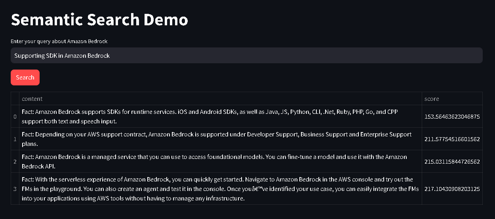

# Semantic Search using Bedrock, FAISS vector DB
* Load the data from the CSV file 
* Generate vector embedding and store in FAISS
* Create a index
* Perform Similary Search with Score for the input and return the result in the table along with Score

## To Run the app
```bash
> streamlit run app.py
```
## Sample Output



